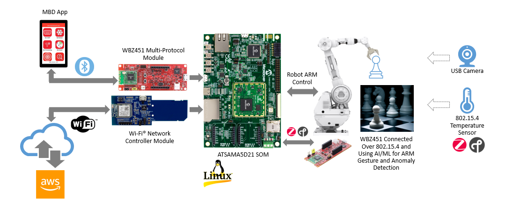
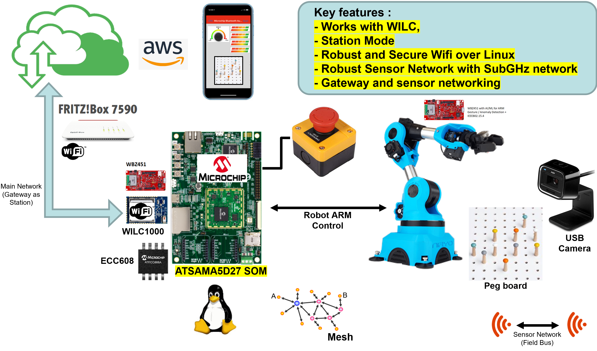
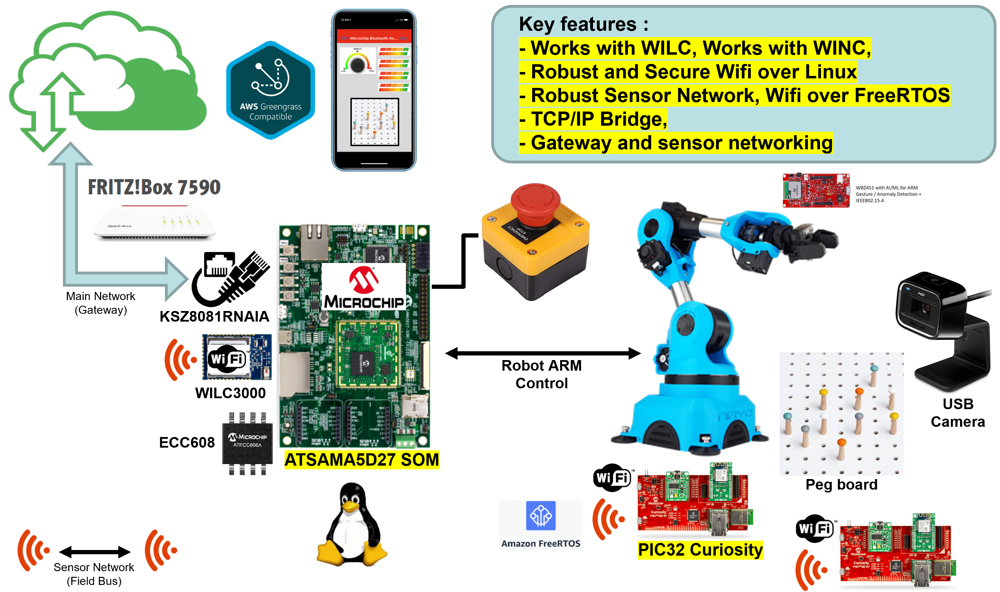
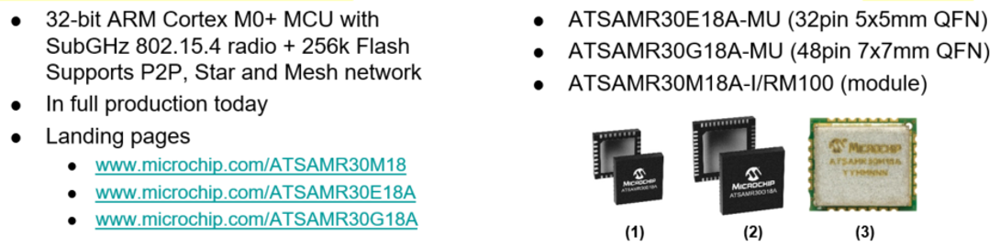

# iot_solutions_for_industry_4.0
> “Wireless Made Fun!" - IoT Solutions for Industry 4.0

1. [Facts and challenges of Industry 4.0](#step1)
1. [Our solution : "IoT Solutions for Industry 4.0"](#step2)
	1. [System architecture](#step2a)
	1. [First and foremost, made secure and robust](#step2b)
	1. [Cloud solutions](#step2c)
	1. [Technology bricks](#step2d)
		1. [Linux](#step2d1)
		1. [Security](#step2d2)
		1. [Wi-Fi](#step2d3)
		1. [Sub GHz Network](#step2d4)
1. [Do It Yourself](#step3)
	1. [Bill of materials](#step3a)
	1. [Step by step guide](#step3b)
	1. [Hardware](#step3c)
	1. [Software](#step3d)
		1. [Linux Python Application](#step3d1)
		1. [MiWi Mesh Application](#step3d2)
		1. [AWS Web Application](#step3d3)

## Facts and challenges of Industry 4.0 

The fourth industrial revolution (so called Industry 4.0) is a reality, happening now with production lines being upgraded with cloud connectivity. Equipment (sensors and actuators, timers, PLC, drives...) gets smarter and augmented with Machine Learning, Cloud and Edge Artificial Intelligence along other analytics functions. 
Every unit can now add its value to the entire system along to every single link of the chain, as every node can share valuable data to all and at the same time make decisions on its own. It’s a great opportunity to better track supplies, automate production, implement predictive maintenance and much more. 
 
But here come 2 challenges for developers building Industry 4.0 products: 
1)	Highest robustness and reliability standards are required  
2)	Vulnerability is not an option, highest cyber-security standards are required  
 

 

## Our solution : "IoT Solutions for Industry 4.0" 

 

To help you go through these challenges, Microchip Technology has built this demonstrator, integrating our state-of-the-art solutions with a focus on robustness and security. This application manages a sensor network while controlling a robot, and report data thru an HMI. Several use cases are provided (Station, SoftAP or concurrent modes - Ethernet, Wifi and SubGHz connectivity – Standalone, AWS IoT or AWS Greengrass…) to best adapt our solutions to your need. 
Check it out here: 

 
And enjoy this Github session
 

### System architecture 

Main unit (see “ATSAMA5D27-SOM1-EK1” Development Kit) has the following functionalities 
- First and foremost, it drives the robot operations. This will be here your typical factory automation operations: moving, cutting, bending, pressing or connecting pieces altogether 
- Collecting and processing sensors data 
The automation operations described earlier can only be possible if robot is fully aware of its environment. So, the need of collecting data related to the assembly line environment (input), the operation performed (the output or result of a given operation) but also the robot status  
    - Are the pieces available for process, ready to be manipulated, in the expected position?  
    - Was the operation performed as expected, with no defect?  
    - Is the robot back to the expected position? Capable of executing next operation? Do we detect any suspicious behaviour or status that could later damage robot or create a line down (see high temperature, unexpected vibration, noise…)? 
- Reports status of its operation to and gets directive from a local console (use case 1), or from a global and decentralized system managed from the cloud (use case 2, 3 or 4) 
- Operate safely to say, support an emergency shut down mode (robot could get stopped in no time) 
- Last but not least, monitor its own environment to prevent future issue: predictive maintenance 

To ensure real time operations, with high robustness and security, gateway is based on SAMA5 MPU running a Linux Operating system, with robust Wifi Link Controller (ATWINC1000) fully tested for interoperability and CE/FCC/IC certified
  

  
Sensors are connected to the gateway thru a SubGHz network, based on SubGHz SAMR30M Module and its associated development kit <a href="https://www.microchip.com/Developmenttools/ProductDetails/AC164159" target="_blank">(see AC164159 - SAMR30M Xplained Pro Evaluation Kit from Microchip)</a> 
SAMR30M supports IEEE 802.15.4 PHY based protocols, for instance in particular Microchip's own MiWi Networking protocols for self-healing Point-to-point, Star and Mesh networking (see <a href="https://www.microchip.com/miwi" target="_blank">Microchip MiWi Home page</a>). This is the network we will use here in this demo. 
- MiWi Network set-up in Mesh
- “PAN Coordinator” connected to “ATSAMA5D27-SOM1-EK1” Development Kit
- 2 sensors used for data harvesting 
    - Sensors set-up as “End Device”
    - Sensor 1 acquires the ambient temperature 
    - Sensor 2 acquires the vibration of arm robot, to implement predictive maintenance 
 
 
Built for Industry 4.0, this demo is covering 4 use cases: 
- Use case 1 - Standalone mode (OFF Line) : application data pushed to SmartPhone (Wifi Gateway is set in SoftAP mode) while sensor data gets collected via robust SubGHz Mesh network (see MiWi Mesh based on 802.15.4)
  
  
- Use case 2 - ON Line mode with AWS IoT : application data is pushed to the Cloud using AWS IoT (Wifi Gateway is set in Station mode). No change for sensor network compared to use case 1 : data gets collected via robust SubGHz Mesh network (see MiWi Mesh based on 802.15.4)
  
- Use case 3 - Concurrent mode (Wifi as SoftAP and Station mode): Wifi Gateway supports and operates simultaneously Station and SoftAP modes, aggregating Use cases 1 and 2. No change for sensor network compared to use cases 1 and 2 : data gets collected via robust SubGHz Mesh network (see MiWi Mesh based on 802.15.4)
  
- Use case 4 - ON Line mode with AWS Greengrass: robust connectivity taking full leverage of AWS Greengrass. Here, demonstrator is connected to the Cloud through Ethernet wired connectivity. Sensors now communicate to the Gateway thru Wifi
  

### First and foremost, made secure and robust

- **Robust by design** 
Multiple options (Wireless SOM, SOM, discrete approach with certified module or full discrete implementation) mitigate your risk, proposing you need based on your application constraints (time to market, RF expertise, cost target…). 
This approach is reinforced by reference implementation and reference design provided by Microchip. Copy paste, you can’t make it easier. Microchip also have Chip Down Package, for customers using WILC1000/WILC3000 QFN rather than the certified modules.
 

 
SOM remains good strategy to get started in no time, allowing fast prototyping and shorten your learning curve. And in such mitigate one more time risk.

- **Testing and Certification : one step further for higher robustness** 
Microchip extensively tests silicon, modules & firmware for interoperability and connectivity 
    - In-house Certification prior to agency submission 
    - SQA & regression testing prior to release 
    - Gauntlet automated testing with 57 access points 
        - New APs added quarterly 
        - Full list <a href="https://www.microchip.com/wi-fi-interoperability" target="_blank">here</a> 

    - And Microchip certifies its WiFi solutions, see <a href="https://www.microchip.com/wwwproducts/en/ATWILC1000" target="_blank">ATWILC1000 Home Page</a> and <a href="https://www.microchip.com/wwwproducts/en/ATWILC3000" target="_blank">ATWILC3000 Home Page</a> 

- **End to end Linux approach for all Microchip products** 
 
Solution is developed with full system approach, to ensure that every products interact with highest performance, security and robustness for Linux application. Connecting all dots, making your system Smart, Secure and Connected.
    - Comprehensive <a href="https://www.microchip.com/mpu" target="_blank">MPU portfolio</a>
        - Dedicated internal Linux application team
		- Microchip is committed to Linux Kernel mainlining (In-house maintainer)
        - Target Long-Term Support (LTS) Linux releases
		- Support official LTS kernels for customer peace of mind
		- All Microchip MPUs in production are supported on new kernels
        - Regular posted releases and updates
        - Linux kernel, Yocto / Buildroot and OpenWRT distributions maintained and updated
        - Bug fixes, patches, graphical layers, Python, demo images for all evaluation boards available
        - Community fixes bugs, adds enhancements between releases
        - Free Linux® kernel 4.14.x, see <a href="https://www.linux4SAM.com" target="_blank">linux4SAM.com</a>
    - Wifi portfolio with dedicated <a href="https://www.microchip.com/mpu" target="_blank">Linux ecosystem</a>
        - ATWILC1000/ATWILC 3000 Wi-Fi Link Controller Linux User Guide
        - Linux Driver for WILC1000 & WILC3000
        - ATWILC Devices Linux Porting Guide
        - ATWILC1000/3000 Wi-Fi Link Controller Linux Driver Release Notes v15.3
        - ATWILC1000-SD Evaluation Kit Design Files
        - ATWILC3000-SD Evaluation Kit Design Files
        - <a href="www.microchip.com/design-centers/wireless-connectivity/embedded-wi-fi/get-started-with-wi-fi-for-linux" target="_blank">Wifi Getting Started for Linux</a>
    - Secure Element solution: <a href="https://www.microchip.com/atecc608a" target="_blank">ATECC608A</a>
        - <a href="https://github.com/MicrochipTech/cryptoauthlib" target="_blank">CryptoAuthLib for a Linux project</a>
        - <a href="https://github.com/MicrochipTech/cryptoauthlib/wiki/Greengrass-HSI" target="_blank">AWS IoT Greengrass Hardware Security Interface (HSI)</a>
 

- **Because a Secure Element matters!** 
    - With Trust Platform, leverage Microchip  Secure Manufacturing Infrastructure to Securely Provision Credentials in Your Products.
For deployments of as few as ten units to up to many thousands of devices, Microchip Trust Platform is a cost-effective and flexible solution for onboarding our secure elements in your design and accelerating your product’s time to market.
The Trust Platform is composed of a family of pre-provisioned, pre-configured or fully customizable secure elements.
Credentials are generated inside each secure element’s boundary by leveraging our Hardware Secure Modules (HSMs) that are installed in Microchip factories.
    - It makes Security simple and easy to implement. Available and affordable to all applications even with low volume.
With an end to end Linux approach, Microchip solution provides all hardware reference design and firmware drivers, to get started your application in no time.
So there is no excuse to bring security to your device.
    - The Trust Platform offers three tiers of secure elements—Trust&GO, TrustFLEX and TrustCUSTOM—to provide you with the options and flexibility to meet the requirements of your company’s security model.

 

SAMA5D27-WLSOM1 : <a href="https://microchipdeveloper.com/authentication:trust-platform" target="_blank">Linux drivers with Complete Stack solution available</a> 

 

- **Because a Secure MPU matters too!** 
Comprehensive security feature is embedded inside the ATSAMA5D27 including: 
    - TrustZone and CoreTEE
    - Environmental Monitors (PCI)
    - PCI Pre-evaluation
    - Tamper detection pins (dynamic)
    - Die and Package Security
    - Secure back-up SRAM
    - Secure master key registers
    - Integrity Check Monitor (SHA256)
    - On-the-fly External Memory Encryption
    - RSA/ECC cryptography
    - AES, 3DES, TRNG, SHA, HW acceleration
    - Unique ID -64 bit
    - Customer fuses
    - Permanent Jtag disable by fuses
    - Secure RTC with time stamp
    - Secure Boot & SAM-BA in Secure Mode
	  
Check <a href="https://www.microchip.com/mpu" target="_blank">here</a> for more information 

- **Cloud solutions for robust and secure industrial applications: AWS Greengrass** 
AWS Greengrass is a software that extends AWS Cloud capabilities to local devices, making it possible for those devices to collect and analyse data closer to the source of information, while also securely communicating with each other on local networks. 

    - In other way, it brings real time performance to the next level, with no compromise on robustness and security. Among the key features from AWS Greengrass making end node robust and secure, let’s underline
        - lambda runtime that allows you to execute serverless instructions if needed.
        - A shadow implementation, this means that a Thing has a JSON file (the shadow) where all of its parameters/variables are set and can be modified with lambda functions from the core or from the cloud.
        - A message manager: when the core needs to restart, the Things can still send messages and the core will save them until the core has restarted again.
        - A discovery service, it is a service mainly used by the Things to get certificates to connect to a Greengrass Core.
        - An Over-the-air update agent that allows updating one or more Greengrass Cores on a network at the same time or on predefined schedules. The devices with the Greengrass core will need to have the WiFi activated for this feature to work.
        - A machine learning inference, meaning that the training is done on the cloud servers but the model (the “brain” of the AI) is on the Greengrass device. Better distribution of the tasks for more efficient and robust process.
 
  
 
Check <a href="https://docs.aws.amazon.com/greengrass/latest/developerguide/what-is-gg.html" target="_blank">here</a> for more information 
Check also this nice <a href="http://ww1.microchip.com/downloads/en/Appnotes/Getting-Started-with-AWS-Greengrass-on-SAMA5D2-Application-Note-DS00003170A.pdf" target="_blank">Application note AN3170</a>, helping you getting started with AWS Greengrass on Microchip SAMAD2 MPU 

### Cloud solutions
This demo is using AWS-IoT and AWS-Greengrass but we are not limited to one cloud provider. 
We have partnerships with the largest cloud computing companies. 
- <a href="https://www.microchip.com/design-centers/internet-of-things/amazon-web-services" target="_blank">Amazon Web Services</a> 
	- <a href="https://www.microchip.com/design-centers/internet-of-things/amazon-web-services/intelligent-gateways" target="_blank">AWS Greengrass overview</a> 
	- <a href="https://www.microchip.com/wwwappnotes/appnotes.aspx?appnote=en611788" target="_blank">Get started with AWS Greengrass</a> 
- <a href="https://www.microchip.com/design-centers/internet-of-things/google-cloud-iot" target="_blank">Google Cloud IoT</a> 
- <a href="https://www.microchip.com/design-centers/internet-of-things/microsoft-azure-cloud-computing" target="_blank">Microsoft Azure</a> 
	- <a href="https://github.com/MicrochipTech/Azure-IoT-Heart-rate-monitor" target="_blank">Azure IoT Heart Rate Monitor Demo</a> 

### Technology bricks

Total System Solution from Microchip: 
- Smart   : PIC32 MCU, SAMA5 MPU 
- Connect : WINC/WILC Wi-Fi controllers, SAM R30 SubGHz MCU 
- Secure  : ATECC608A Secure Element 
Comprehensive firmware ecosystem, from Sensor to Cloud (AWS IoT Core, Microsoft Azure, Google GCP) 

End to End approach, Firmware and Harwdare (MCU & MPU), Secure Element, Interoperability testing, Regulatory and Alliance Certifications 

#### Linux

<a href="https://www.microchip.com/design-centers/wireless-connectivity/embedded-wi-fi/get-started-with-wi-fi-for-linux" target="_blank">Get Started</a> with Wi-Fi® for Applications Using the Linux® Operating System 

<a href="https://www.microchip.com/som" target="_blank">Linux MPU System On Modules</a> 
  

Microchip uses its <a href="http://www.at91.com/linux4sam/bin/view/Linux4SAM" target="_blank">linux4sam.org</a> website to provide access to new developments which are reviewed by our Linux maintainers and fully tested on our hardware platforms. 
<a href="https://www.microchip.com/design-centers/32-bit-mpus/linux-os-for-mpus" target="_blank">Linux OS for MPUs</a> 

For the purpose of this demo, linux4sam Github repo has been used for building the image: 
- <a href="https://github.com/linux4sam/linux-at91" target="_blank">Linux Kernel 4.19</a> 
- <a href="https://github.com/linux4sam/buildroot-at91" target="_blank">Buildroot 2019.05</a> 

#### Security

<a href="https://www.microchip.com/design-centers/embedded-security" target="_blank">Embedded Security Solutions</a> 

Pre-provisioned ATECC608A Secure Element <a href="https://www.microchip.com/design-centers/security-ics/trust-platform/trust-go" target="_blank">(Trust & Go)</a> 
Pre-configured and Pre-provisioned Secure Elements for Cloud Authentication. And propose for multiple cloud partners 
  

Along <a href="https://microchipdeveloper.com/authentication:trust-platform" target="_blank">SAMA5D27-WLSOM1 Linux drivers for ATECC608A</a> 
<a href="https://www.microchip.com/wwwproducts/en/ATECC608A" target="_blank">Product landing page</a>  
  

#### Wi-Fi

<a href="https://www.microchip.com/design-centers/wireless-connectivity/embedded-wi-fi" target="_blank">Wi-Fi Solutions</a> 

WiFi link controller: <a href="https://www.microchip.com/atwilc1000" target="_blank">ATWILC1000 Home page</a> 
Same demonstrator could also work with Microchip combo Wifi + BLE: <a href="https://www.microchip.com/atwilc3000" target="_blank">ATWILC3000 Home page</a> 
  

For the purpose of this demo, linux4wilc Github repo has been used for getting the WiFi WILC Firmware and Driver: 
- <a href="https://github.com/linux4wilc/firmware" target="_blank">WILC Firmware Version 15.3</a> 
- <a href="https://github.com/linux4wilc/driver" target="_blank">WILC Driver 15.3</a> 

<a href="https://www.microchip.com/mymicrochip/filehandler.aspx?ddocname=en599776" target="_blank">ATWILC1000/ATWILC3000 Wi-Fi Link Controller Linux User Guide</a> 
<a href="http://ww1.microchip.com/downloads/en/DeviceDoc/ATWILC-Devices-Linux-Porting-Guide-User-Guide-DS70005329D.pdf" target="_blank">ATWILC Devices Linux Porting Guide</a> 
<a href="https://www.microchip.com/mymicrochip/filehandler.aspx?ddocname=en601491" target="_blank">ATWILC1000-SD Evaluation Kit Design Files</a> 
<a href="https://www.microchip.com/mymicrochip/filehandler.aspx?ddocname=en607651" target="_blank">ATWILC3000-SD Evaluation Kit Design Files</a> 
<a href="https://www.microchip.com/mymicrochip/filehandler.aspx?ddocname=en606209" target="_blank">ATSAMA5D27 SOM1 Kit1 User Guide</a> 

#### Sub GHz Network

<a href="https://www.microchip.com/wwwproducts/en/ATSAMR30M18" target="_blank">SAMR30M module landing page</a>  

  

<a href="https://www.microchip.com/miwi" target="_blank">MiWi landing page</a>  
MiWi™ Protocol has been developed by Microchip to enable low-cost, commercial and smart home networks.
The MiWi™ protocol is used in applications such HVAC systems and alarm sensors where reliable self-healing mesh networking is needed. The MiWi protocol supports operation in the IEEE 802.15.4 radio PHY in the sub-GHz and 2.4 GHz ISM bands. 
The MiWi protocol stack offers a significantly smaller footprint relative to the open standard-based Zigbee® compliant protocol stack. This enables operation in microcontrollers with smaller memory/lower cost. A typical end node requires only 20 KB of code space. 

* <a href="https://www.microchip.com/mymicrochip/filehandler.aspx?ddocname=en609774" target="_blank">MiWi Quick Start Guide</a> 
* <a href="https://www.microchip.com/mymicrochip/filehandler.aspx?ddocname=en609705" target="_blank">MiWi Software Design Guide</a> 
* <a href="https://www.microchip.com/mymicrochip/filehandler.aspx?ddocname=en609798" target="_blank">MiWi Version Migration Guide</a> 

  

And visit Microchip Github for a complete MiWi Mesh demo to monitor temperatures:
<a href="https://github.com/MicrochipTech/Wireless-Sensor-Network-2019" target="_blank">Wireless Sensor Network demo</a> 

## Do It Yourself

### Bill of materials

- <a href="https://shop.sb-components.co.uk/products/piarm-the-diy-robotic-arm-for-raspberry-pi?variant=27857777098835" target="_blank">1x PiArm Robot with motor control board</a> 
“PiArm”, DIY Robotic arm supporting Raspberry Pi from SB Components Ltd 
PiArm is a Raspberry Pi based DIY robotic arm outfitted with 6-axis digital computerized servo motors and 360 degrees of rotation liberation designed and developed for kids, makers, techies, and everyone.
    - PiArm features:
        - Fully metallic body
        - Equipped with 6-axis digital servo meters and 360 degrees of rotation system.
        - Easy to assemble and can be controlled by multiple devices like laptops, smartphones, joystick, etc.
        - Based on the Python language and the open-source code is available for secondary development.
        - Compatible with all versions of Raspberry Pi such as 4B, 3B+, 3, 2, A+, B, Zero W, Zero, etc.
    - Servo Features:
        - Python-based code capable of running on any platform like Linux or Windows.
	    - Connect the shield through a couple of options: through USB or through GPIO.
        - Power to provide a single power source to the Raspberry Pi and the PiArm.

- <a href="https://www.amazon.fr/Microsoft-LifeCam-HD-3000-Webcam-720p/dp/B0096M4QOY/ref=sr_1_1?__mk_fr_FR=%C3%85M%C3%85%C5%BD%C3%95%C3%91&keywords=lifecam+microsoft+5000+HD&qid=1581350549&sr=8-1" target="_blank">1x LifeCam HD 3000 USB Camera from Microsoft</a> 
This demo uses this solution from Microsoft but any USB webcam from the market can do the job. 
 

- <a href="https://en.avm.de/products/fritzbox/fritzbox-7590/" target="_blank">1x Fritz!Box 7590 Router from AVM</a> 
Top model Wifi Router from AVM portfolio 
 

- <a href="https://www.mikroe.com/secure-4-click" target="_blank">1x "Secure 4 Click" Click board from Mikroe</a> 
Part of the well-known “Click board” family, Mikroe’s extension boards with over 700+ sensors, actuators, and connectivity (see full family <a href="https://www.mikroe.com/click" target="_blank">here</a>) 
The "SECURE 4 CLICK" includes the ATECC608A, a secure CryptoAuthentication™ device from Microchip.  It will bring our system security one step further. 
 

- <a href="https://www.microchip.com/DevelopmentTools/ProductDetails/PartNO/ATSAMA5D27-SOM1-EK1" target="_blank">1x SAMA5D27-SOM1-EK1</a> 
The SAMA5D27 SOM1 Kit1 is a fast prototyping and evaluation platform for the high-performance 32-bit Arm® Cortex®-A5 processor-based MPU from Microchip running up to 500 MHz. Namely, the SAMA5D2-based System in Packages (SiPs) and the SAMA5D27 System-On-Module (SAMA5D27-SOM1).  
This kit comprises a baseboard with a soldered SAMA5D27-SOM1 module.  
This development kit will enable one or several of these functions, depending on the considered use cases (see later paragraph) 
    - First and foremost, drive the Robot and perform the pick & place pattern (all use cases) 
    - Manage the sensors network made of SAM R30M Xplained Pro Evaluation Kits (see use case 1, 2 & 3) 
    - Manage the USB camera : video streaming (see use case 1 & 3) and picture acquisition for visual inspection (see use case 2 & 3) 
    - Cloud connectivity (see use case 2, 3 & 4) 
 

- <a href="https://www.microchip.com/DevelopmentTools/ProductDetails/PartNO/ATWILC1000-SD" target="_blank">1x ATWILC1000-SD</a> 
The ATWILC1000-SD evaluation kit is a hardware platform to evaluate the ATWILC1000-MR110PB module. The ATWILC1000-SD is based on the SmartConnect WILC1000, an IEEE 802.11 b/g/n IoT link controller module. It is the ideal add-On to existing MCU solutions bringing WiFi through UART or SPI/SDIO-to-WiFi interface. 
 

- <a href="https://www.microchip.com/Developmenttools/ProductDetails/AC164159" target="_blank">3x SAMR30M Xplained Pro (AC164159)</a> 
The SAM R30M Xplained Pro is a hardware platform designed to evaluate the SAMR30M18A module. Used here for our sensors network, monitoring key variables of our application (presence, temperature, vibration…).  
In this demo, we will program these boards with true routing Mesh firmware from Microchip (see <a href="https://www.microchip.com/miwi" target="_blank">MiWi landing page</a>) and use on-board <a href="https://www.microchip.com/wwwproducts/en/AT30TSE758A" target="_blank">AT30TSE758A Digital Temperature Sensor</a>. This board could also be used to connect additional sensors such as accelerometers, and in such enables new use cases such as predictive maintenance. 
 

- <a href="https://www.amazon.fr/dp/B079QY57LN/ref=dp_prsubs_1" target="_blank">1x Emergency Button</a> 
 

- Miscellaneous hardware 
    - USB Hub with external power source (Belkin F4U041UK) 
 
    - Micro USB Cables 
    - USB Type-C to USB Type-A Female Adapter (OTG) 
	- USB Power Charger 
	- 4x Cubes with 4x magnets (used for robot arm pick and place) 
	20mm x 2mm Coin magnets 
 	
	- 16x magnets to put beneath the chessmate 
    - M3 X 10 mm Male-Female Brass spacer 
    M3 X 35mm Male to Female Brass Spacer 
    M3 Hex Nut Brass 
 

### Step by step guide

We started building the first robot arm over a prototype platform. 

 

 
And validated the demo ... 

 
See one of the prototype in action: 
 
Then from prototype to real demo, we integrated the whole solution into final casing. 

 

Support for the camera: 

 

Drawing and dimensions: 

 

Check out the Doc/Fixture Drawings.pdf file for the dimensions and 3D outlook of the final platform. 

Check the video posted on youtube: 

### Hardware

Boards connection: 
 
USB Hub is used to power some boards but also used to allow data communication between boards. 
Some boards have to be power supplied from independent power sources to avoid USB conflict in the demo due USB mounting enumeration.

### Software

#### Linux Python Application

Checkout the application source code located into Software/Linux_Python_Application_public.zip package

- Application files:
    - iot_sam.py (main application file)
    - Eww_robo.py
    - Eww_robo_misc.py
    - Piarm.py
    - Serial_comm.py
- Robot calibration files:
    - Eww_robo_calib.json (file which contains the calibration data)
    - eww_robo_calibration.py (script file)

#### MiWi Mesh Application

From Software/MiWi.zip package, you are getting two Atmel Studio 7.0 projects. 

- ED_XMOD1 (End-Device): Project derived from ASFv3.47 MiWi Mesh EndDevice - WSN Demo Application (SAM R30 Module Xplained Pro)
- PAN_CORD_MOD (Pan-Coordinator): Project derived from ASFv3.47 MiWi Mesh PanCoordinator - WSN Demo Application (SAM R30 Module Xplained Pro)
 
The pan coordinator device creates the network and the end device perform an association in order to join the network. 
The end device transmits periodically the temperature information to the pan coordinator.

#### AWS Web Application

Checkout the dashboard source code located into Software/Dashboard_public.zip package.
 
You need an AWS account and your own certificates. 2 sets of certificate should be provided by AWS (one for the device, one for the web server application).

The package contains:
- HTML Web page (main.html)
- Python code for the web server (app.py). The application should run in AWS ec2-instance or run in local network. The images captured by the USB camera are sent over MQTT message and stored in S3 bucket cloud.

